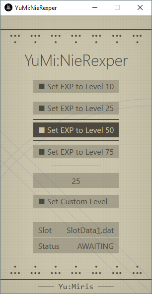

<h1 align="center">NieRexper</h1>
<p align="center">
	
 <br><br>
 Level Patcher for NieR:Automata
</p>

# Introduction

In a nutshell, this little tool changes the level on your NieR:Automata save file. Want to be level 25 again? Click on the button, choose your slot and that's it!

## How?

The technical gist of it is that N:A deduces the level based on your current EXP, thus the EXP value must be changed to the value required by the respective level.

## Why?

Once you reach level 50+, the game's difficulty becomes rather trivial. To bring back the difficulty, I've made this program to swiftly downgrade my level. Of course, one could use it to boost their level. >_>

# Instructions

0. Note that .NET 4.5 is required to run the executable!
1. Download the executable and run it.
2. Click on the save slot you want to modify, then click on the level you want to apply. Done!
   - If you want, you can apply your own custom level, too.
4. If all worked, you should see `Status: SUCCESS` in the window!
   - The tool will make a backup of your original save with a random string appended to its name; e.g. `SlotData_0-5d8fe167.dat`.

# Development

This repository provides the `YuMi.NieRexper` library, which handles

- returning the EXP required for a specified level;
- patching a specified save slot with the specified EXP amount.

The library can be imported by any .NET >=4.5 project. Feel free to use it in your project!

## EXP Calculation

```cs
// Suppose we want the EXP required for level 10...
int expWantedLevel = 10;

// We create an instance of ExpCalculator in the YuMi.NieRexper.Calculation namespace.
var expCalculator = new YuMi.NieRexper.Calculation.ExpCalculator()

// We then call the Calculate() method with our wanted level as the argument.
// It will provide us with the EXP needed to reach that level.
int expForTheLevel = expCalculator.Calculate(expWantedLevel);
```

## EXP Patching

### Patching

```cs
// Let's get the absolute path for, say, the first save slot used by the player.
var saveSlotPath = "C:\\SlotData_0.dat";

// We now create an instance of SlotPatcher and provide the save slot path to its constructor.
var savesPatcher = new YuMi.NieRexper.Patching.SlotPatcher(savesSlothPath);

// We then call the Patch() method with our wanted EXP as the argument.
savesPatcher.Patch(expForTheLevel); // or 3184
```